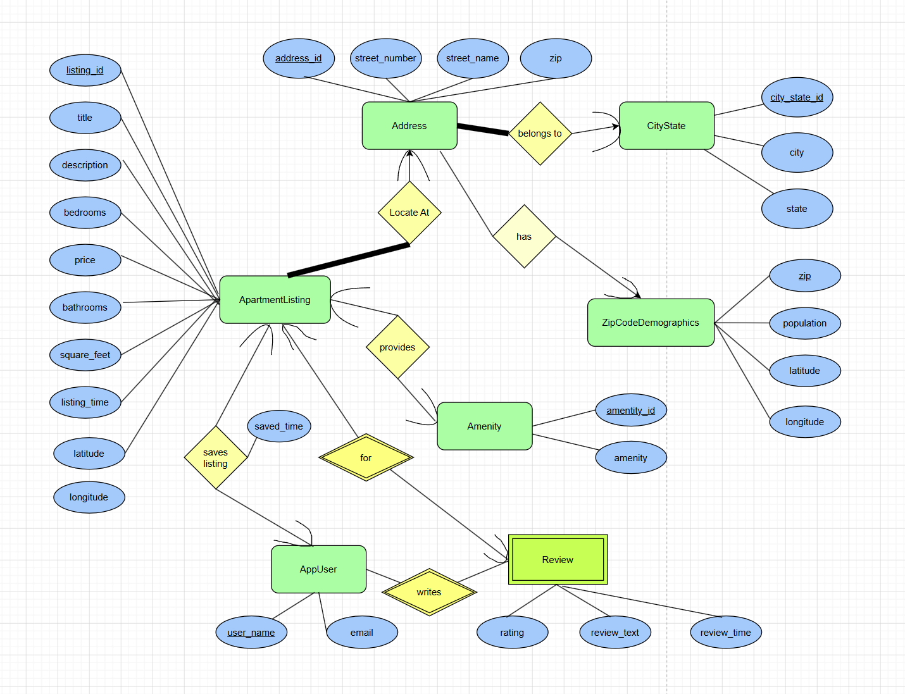

# COMPSCI 564 Project

## ER Diagram



## Data Preparation

Raw data is stored in `data/raw/` and processed by
`scripts/raw_data_processor.py`. The script generates MySQL-importable CSV files
under `data/import/`.

Run the processor with:

```bash
python scripts/raw_data_processor.py
```

On Windows PowerShell or Command Prompt, use `\` instead of `/` in file paths,
for example `python scripts\raw_data_processor.py`.

The default run shifts apartment listing times so the newest listing date becomes
`2026-07-28`. This keeps the original relative ordering of listing times while
making demo queries such as "listed in the last two weeks" useful. To choose a
different latest listing date:

```bash
python scripts/raw_data_processor.py --target-max-date 2026-07-28
```

Generated files that are ready for MySQL import are under `data/import/`:

- `CityState.csv`
- `ZipCodeDemographics.csv`
- `Address.csv`
- `ApartmentListing.csv`
- `Amenity.csv`
- `ListingAmenity.csv`

Processing notes:

- Apartment rows are read as physical lines instead of using Python's CSV parser
  because some raw apartment records contain confusing quotation marks.
- Every physical apartment data line is treated as one listing record.
- Missing listing city/state values reuse the previous valid city/state.
- Missing ZIP values use the first matching ZIP found in `uszips.csv` for that
  city/state.
- Listings with missing raw addresses receive deterministic synthetic addresses:
  realistic-looking street numbers and names are selected from a fixed,
  reproducible address space. Synthetic street names end in `(S)` so they are
  easy to identify. The inferred ZIP and city/state are retained.
- Synthetic addresses are included to make the dataset more useful for learning
  and demonstrating database design and queries. They are not real locations.
- Missing numeric values that can cause MySQL import trouble are filled with `0`.
- `ZipCodeDemographics` uses ZIP, population, latitude, and longitude from
  `uszips.csv`.

## Table Creation

Copy and paste the contents of `create_tables.sql` into the MySQL command line
or MySQL Workbench before importing the CSV files.

## Data Import

Recommended MySQL import order:

1. `CityState`
2. `ZipCodeDemographics`
3. `Address`
4. `ApartmentListing`
5. `Amenity`
6. `ListingAmenity`

To purge and load all six prepared tables automatically:

```bash
python scripts/import_mysql_data.py
```

On Windows PowerShell or Command Prompt, use:

```bash
python scripts\import_mysql_data.py
```

The importer deletes existing rows first in reverse dependency order, then
inserts the CSV data in the recommended order above. It prompts for MySQL user,
schema, and password. The schema defaults to `MYSQL_DATABASE` when set, otherwise
`CS564`.

## SQL Folder

The `sql/` folder contains checkpoint 3 SQL scripts for building, testing, and
demonstrating the database:

- `checkpoint3_create_tables_reference.sql` defines the reference table schema.
- `checkpoint3_app_tables_and_seed.sql` creates and seeds supporting
  application tables.
- `checkpoint3_sql_queries.sql` contains example analytical and application
  queries.
- `checkpoint3_stored_procedures.sql` defines stored procedures for common
  database operations.
- `checkpoint3_baseline_performance.sql` records baseline query performance
  checks.
- `checkpoint4_indexes.sql` creates the performance indexes used for the
  indexing checkpoint.

## Checkpoint 4 Indexes

Run `checkpoint4_indexes.sql` only after recording the baseline performance
from `checkpoint3_baseline_performance.sql`. The file adds secondary indexes
for the selected checkpoint queries, including composite indexes for amenity
lookups, listing search filters, price-based scans, and repeated listing
lookups.

```bash
mysql -u root -p cs564 < sql/checkpoint4_indexes.sql
```

## User Interface

The `webserver/` folder contains a Flask apartment-search web app. Install the
Python dependencies first:

```bash
pip install -r requirements.txt
```

Before starting the server, make sure the base tables, imported data, app demo
tables, and stored procedures have been loaded into MySQL:

```bash
mysql -u root -p cs564 < sql/create_tables.sql
python scripts/import_mysql_data.py
mysql -u root -p cs564 < sql/checkpoint3_app_tables_and_seed.sql
mysql -u root -p cs564 < sql/checkpoint3_stored_procedures.sql
```

Start the web server with:

```bash
python webserver/app.py
```

On startup, the server prompts for MySQL database connection information. The
schema defaults to `cs564` and the user defaults to `root`. By default, open:

```text
http://127.0.0.1:8000
```
